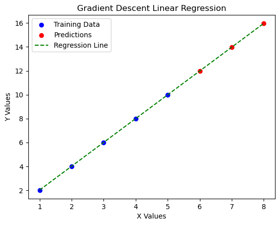
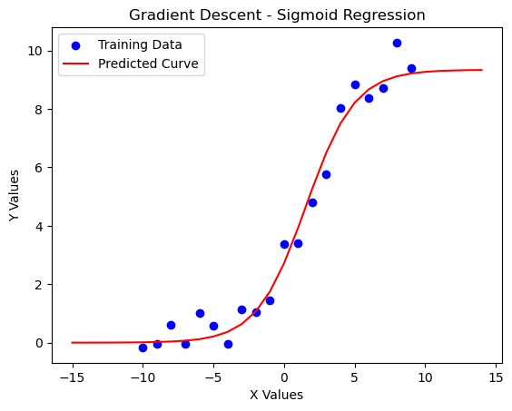

# Gradient-descent-from-scratch
This project builds **Gradient Descent for Regression from scratch** without using **NumPy, SciPy, or other libraries**.  
It includes **Single & Multi-Variable Regression** with **custom derivatives and cost functions**.


The algorithm iteratively **updates parameters** by computing gradients and **minimizing the error function**.

## **Performance Results**  

### Simple linear regression:

Gradient Descent **optimizes** a simple **y = wx + b** model.

**Final optimized parameters**
```
w = 1.99, b = 0.017
Final MSE: 5.51e-5
```

```For X_test = [6, 7, 8] → Predictions = [11.98, 13.98, 15.97]```



### Simple multi variable regression:
```
w1 = 1.98, w2 = 1.01, b = 0.05
Final MSE: 7.5437044725299e-05
```

```For X_test = [[6, 7], [7, 8], [8, 9]] → Predictions = [11.985909892207738, 13.98017599652841, 15.97444210084908]```


### Non-linear sigmoid regression

Gradient Descent **optimizes** a sigmoid function of the form: y = a / (1 + exp(-b * (x - c)))

```
Final MSE: 0.5573858836034409
```



### Non-linear logarithmic regression

Gradient Descent **optimizes** a log function of the form: y = a * log(b * x) + c

```
Final MSE: 1.7408196891677037
```

